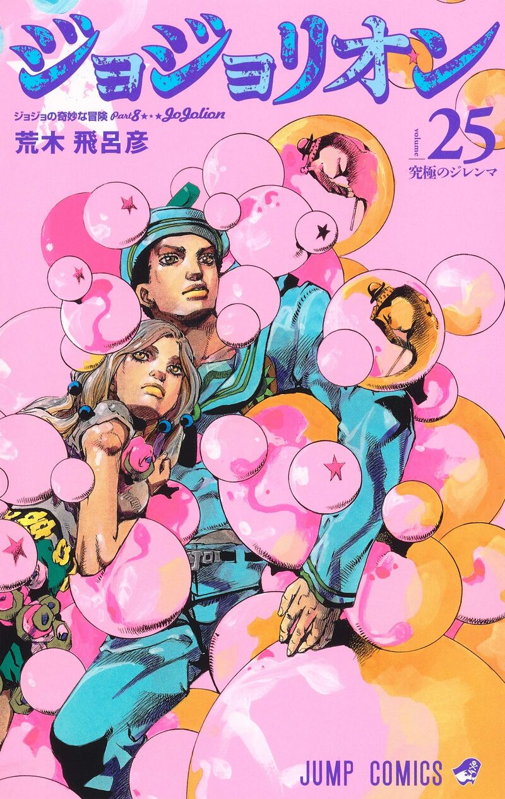

# Jojolion.nvim

A theme I made based off my favourite Jojo's bizarre adventure part 8.

The theme is based off of the volume 25 cover, I used wallust and terminal.sexy to generate and configure the colours.



## Setup

I use vim.pack.add so thats the only one I can talk on but all I did was

```lua
vim.pack.add({ src = "https://www.github.com/YashNaga/jojolion.nvim" })
require("jojolion").setup()
vim.cmd("colorscheme jojolion")
```

The theme is pretty primitive so if you have any suggestions or changes let me know or fork the project do you what you want idc its a free world.

Also I have the snippet I use for the theme on wsl in extras, feel free to adapt the colours if you can I'm too lazy to make it compatible with everything
